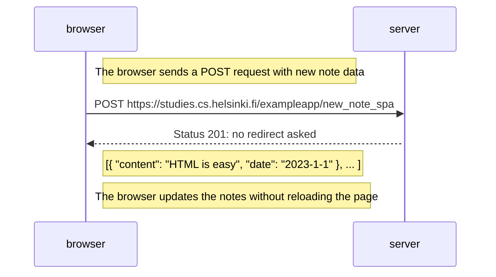

```mermaid

sequenceDiagram
    participant browser
    participant server

    Note right of browser: The browser sends a POST request with new note data 
    browser->>server: POST https://studies.cs.helsinki.fi/exampleapp/new_note_spa
    activate server
    server-->>browser: Status 201: no redirect asked

    Note right of browser: [{ "content": "HTML is easy", "date": "2023-1-1" }, ... ]
    Note right of browser: The browser updates the notes without reloading the page

    participant browser
    participant server
```
